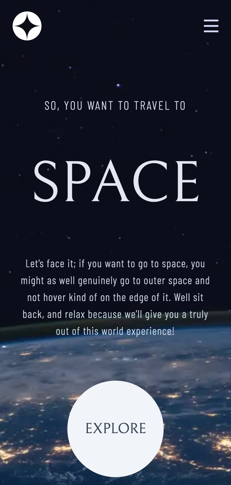
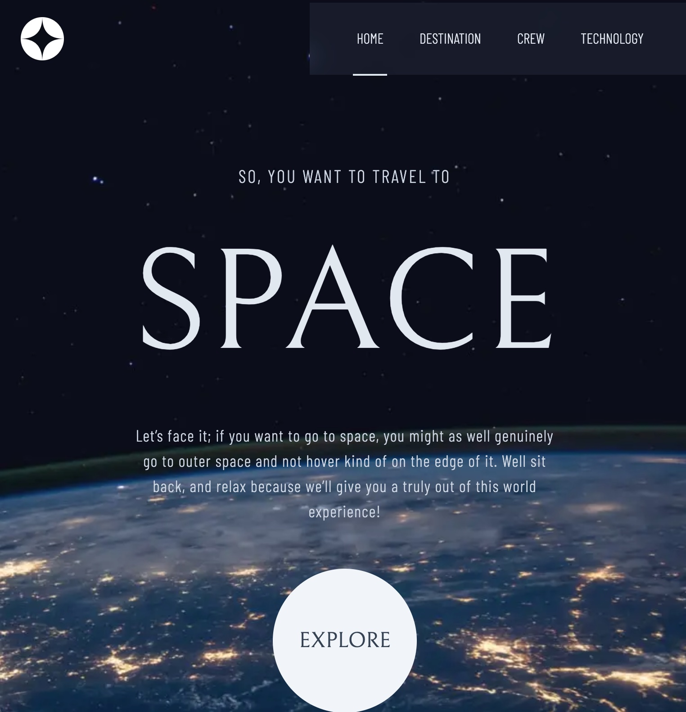
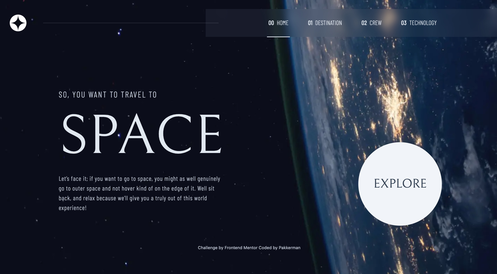

# Frontend Mentor - Space Tourism Multi-page Website

This is a solution to the [Space tourism multi-page website](https://www.frontendmentor.io/challenges/space-tourism-multipage-website-gRWj1URZ3).


### Screenshots

<div align='center'>
    <h2>Mobile Screenshot</h2>
    
</div>

<div align='center'>
    <h2>Tablet Screenshot</h2>
    
</div>

<div align='center'>
    <h2>Desktop Screenshot</h2>
    
</div>


### Solution Requirements

- [x] Optimal layout for each of the website's pages depending on their device's screen size
- [x] Hover states for all interactive elements on the page
- [x] Toggle between the tabs to see new information

### Modifications
- [x] Small Animations
- [x] Added link to next section in the selection section

### Tasks
- [x] Navbar for all layout
- [x] Mobile menu 
- [x] Home Page content
- [x] Destination Page content
  - [x] Optimal on all layout
  - [x] Destination selection 
  - [x] Added spinning animation
- [x] Crew Page content
  - [x] Optimal on all layout
  - [x] Crew selection 
- [x] Technology Page content
  - [x] Optimal on all layout
  - [x] Tech selection 

### Styling
- [x] Background on all layouts and all pages
- [x] Navbar on all layouts

### Optimizations
- [x] Preloading Fonts
- [x] Image Loading
  - [x] Background image loading
- [x] Minimal layout change when selection destination and meeting crew


### Notes
- Background image handling 
  - It's really tricky to use bg-[] for background image with tailwind, there are total 12 of images across all different layouts, the complete string of the classname must be appear somewhere in the code in order for tailwind to parse and added to the stylesheet, this defeats goal of dynamically generating different background depending on page and size in the first place, so opt to using Imaging instead.

- Pesky cursor-pointer and touch screen tap highlighting
  - When a cursor-pointer applied, on touch devices, will have a short flash when tap, looks very cheap, and disiabling it using media query is just asking for trouble and still will not solve if on mobile device with a mouse. so I found these property that will help with do the trick:
  - ```
    -webkit-tap-highlight-color: transparent; /* For Safari, iOS */
    tap-highlight-color: transparent; /* For some Android browsers */
    ```

### Links

- [Github repo](https://github.com/Pakkerman/space-tourism-website)
- [Deployed on Vercel](https://space-tourism-website-orpin-omega.vercel.app/)

### Built with

- [Create T3 App](https://create.t3.gg/)
  - [Nextjs](https://nextjs.org/)
  - [React](https://react.dev/)
  - [TailwindCSS](https://tailwindcss.com/)

